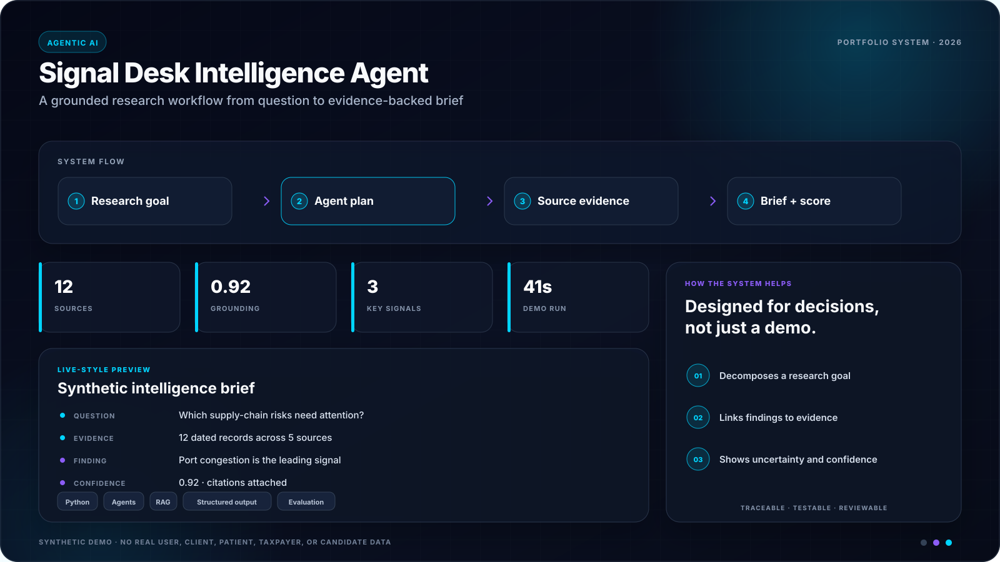

# Signal Desk Agent (v2)


<!-- portfolio-showcase:start -->
<p align="center">
  
</p>
<p align="center"><sub><strong>Portfolio preview:</strong> all names, records, metrics, and scenarios shown above are synthetic. No real user or customer data is included.</sub></p>
<!-- portfolio-showcase:end -->

[](https://github.com/akhil15123/signal-desk-agent/actions/workflows/ci.yml)

Signal Desk Agent is a full-stack GenAI project that turns a research prompt into a structured intelligence brief.

Instead of returning a loose chat transcript, the backend forces the model to:

- search the web for current signals
- save findings as typed records
- save timeline events as typed records
- submit a final briefing payload with summaries, recommendations, watchlist items, and source links

The result is a repo that feels closer to an operator tool than a demo chatbot.

## What It Does

- React + TypeScript briefing workspace with a strong visual shell
- Express backend with OpenAI Responses API orchestration
- Built-in web search plus custom tool calls for report assembly
- Demo route for previewing the product without an API key
- Typed report contract rendered directly in the UI
- Tests covering the demo contract and HTTP path

## Stack

- Frontend: React 19, TypeScript, Vite
- Backend: Express, TypeScript
- AI: OpenAI Responses API via the `openai` Node SDK
- Validation: Zod
- Tests: Vitest, Supertest

## Local Setup

1. Install dependencies:

```bash
npm install
```

2. Copy the environment template and add your key:

```bash
cp .env.example .env
```

3. Start the app:

```bash
npm run dev
```

Client runs on `http://localhost:5173` and the API runs on `http://localhost:8787`.

## Environment

```bash
OPENAI_API_KEY=your_key_here
OPENAI_MODEL=gpt-5-mini
PORT=8787
```

`OPENAI_MODEL` is optional. The app defaults to `gpt-5-mini`.

## Commands

```bash
npm run dev
npm run build
npm test
npm run lint
```

## App Routes

- `POST /api/brief`
  Runs a live agent-backed research brief. Requires `OPENAI_API_KEY`.

- `POST /api/demo`
  Returns a sample structured brief so the interface can be reviewed without live credentials.

- `GET /api/health`
  Health probe for local checks.

## How The Agent Works

1. The user provides a topic, objective, mode, and audience.
2. The backend sends that mission to the OpenAI Responses API.
3. The model can use:
   - built-in `web_search_preview`
   - `save_finding`
   - `save_timeline_event`
   - `submit_brief_report`
4. The UI renders the returned report object directly.

This makes the project easier to test and extend than a markdown-only chat output.

## Demo Workflow

If you do not want to wire credentials immediately:

1. Start the app with `npm run dev`
2. Open the UI
3. Click `Load demo`

You will get a sample brief, trace log, recommendations, and source cards without calling the OpenAI API.

## Possible Extensions

- Add streaming status updates during live runs
- Persist briefs to a database
- Add exports for PDF or Slack-ready summaries
- Add domain filters or vertical-specific prompt packs
- Add evaluation cases for prompt and tool-call quality
